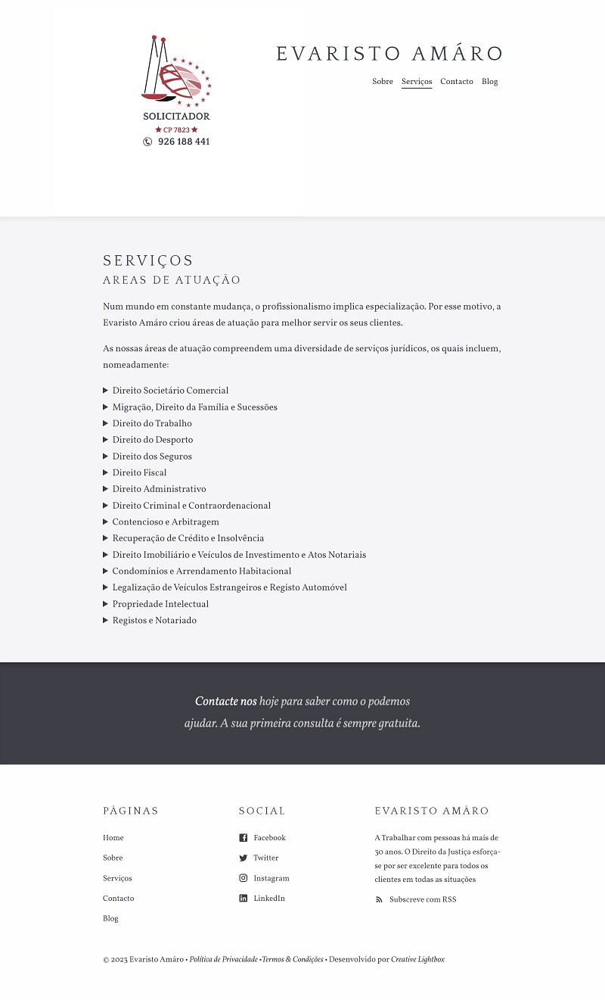

# Solicitor

Solicitor is a firm business website in Development.

## Design

Design Phase is Approved by the client. Below is a sample services page.



## Stack

Built with Next.js and Markdown

<p align="right">(<a href="#readme-top">back to top</a>)</p>

## Features

- Contact form
- Home page
- Blog page
- About page
- Services page
- Contact page
- Contact form
- Pre-styled components
- Post category pages
- Disqus comments for posts
- Staff and author system
- Configurable footer
- Optimised for editing in [CloudCannon](https://cloudcannon.com/)
- RSS/Atom feed
- SEO tags
- Google Analytics

<p align="right">(<a href="#readme-top">back to top</a>)</p>

## Setup

1. Add your site and author details in `content/data/seo.json`.
2. Add your Google Analytics and Disqus keys to `content/data/site.json`.
3. Get a workflow going to see your site's output (with [CloudCannon](https://app.cloudcannon.com/)
   or Next.js locally).

## Develop

Solicitor is built with [Next.js](https://nextjs.org/) (version `13.0.4`).

<p align="right">(<a href="#readme-top">back to top</a>)</p>

### Installation

```bash
npm install
```

<!-- DEVELOPMENT -->

## Development

First, run the development server:

```bash
npm start
```

or

```bash
npm run dev
```

Open [http://localhost:3000](http://localhost:3000) with your browser to see the result.

<p align="right">(<a href="#readme-top">back to top</a>)</p>

## Editing

Solicitr is already optimised for adding, updating and removing pages, staff, posts, company details
and footer elements in [CloudCannon](https://app.cloudcannon.com/).

### Posts

- Add, update or remove a post in the _Posts_ collection.
- The **Staff Author** field links to members in the **Staff** collection.
- Change the defaults when new posts are created in `content/posts/_defaults.md`.

### Contact Form

- Preconfigured to work with [CloudCannon](https://app.cloudcannon.com/).
- Sends email to the address listed in company details.

<p align="right">(<a href="#readme-top">back to top</a>)</p>

### Staff

- Reused around the site to save multiple editing locations.

### Footer

- Exposed as a data file to give clients better access.
- Set in the _Data_ / _Footer_ section.

### Company details

- Reused around the site to save multiple editing locations.
- Set in the _Data_ / _Company_ section.

<p align="right">(<a href="#readme-top">back to top</a>)</p>

## License

Distributed under the MIT License. See `LICENSE.txt` for more information.

## Contact

José Horta - [@josh_hortt](https://twitter.com/josh_hortt)

My E-mail - [joshhortt@yahoo.com](joshhortt@yahoo.com)

<p align="right">(<a href="#readme-top">back to top</a>)</p>
